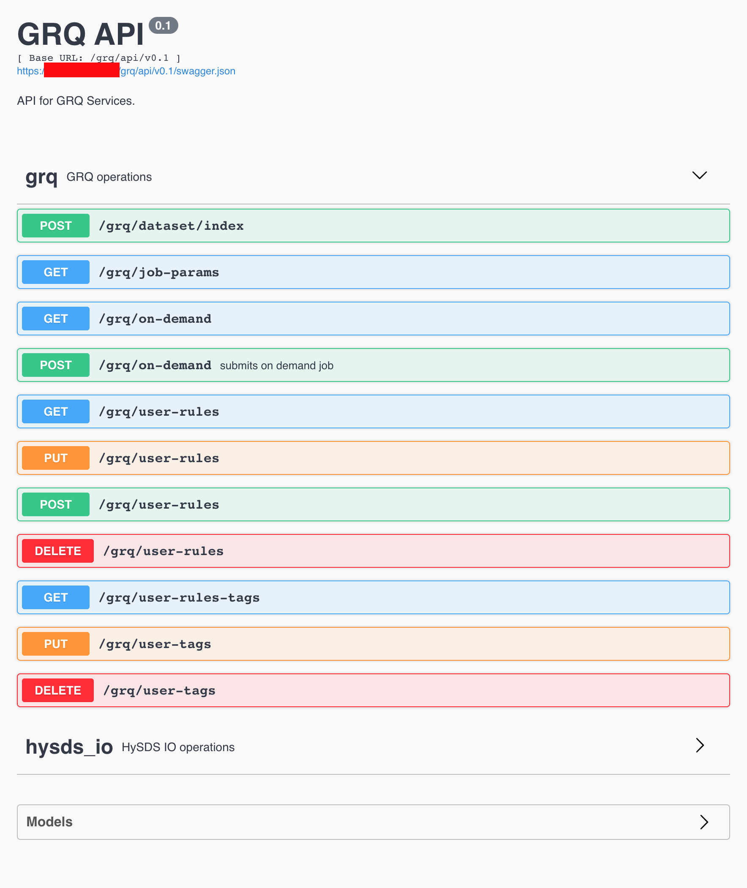

grq2
====

GeoRegionQuery, REST API using ElasticSearch backend.

Create virtualenv using SciFlo system packages
----------------------------------------------
```bash
virtualenv --system-site-packages env
```

Install Dependencies via pip
----------------------------
```bash
pip install flask
pip install gunicorn
pip install gevent
```

To run in development mode
--------------------------
```bash
python run.py
```

To run in production mode
--------------------------
As a daemon:
```bash
gunicorn -w2 -b 0.0.0.0:8878 -k gevent --daemon -p grq2.pid grq2:app
```

In the foreground:
```bash
gunicorn -w2 -b 0.0.0.0:8878 -k gevent -p grq2.pid grq2:app
```

Swagger UI
-----------
* `https://<mozart host>/grq/api/v0.1/` (api `v0.1`)
* `https://<mozart host>/grq/api/v0.2/` (api `v0.2`)


